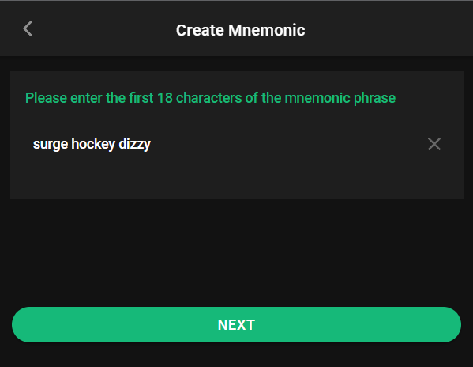
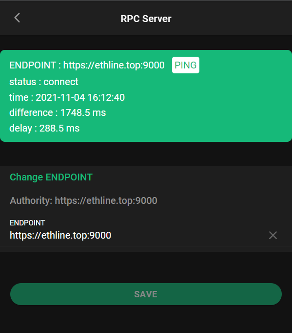

# ETH LINE SUMMIT


> With EthLine App, it is an encrypted real-time communication software, it is based on [Ethereum](https://github.com/ethereum) ERC20 SECP256K1 to achieve end-to-end encryption, it can deliver messages on time, safely and free of charge 
> * Data charges may apply. Contact your provider for details.
>


    


## 🏳️‍🌈 Link

[Mobile WEB](https://app.ethline.top/)


## 🚀 Start

### Step1 : Create Mnemonic

💥 `All your sensitive data` on this APP is `only stored locally` in encrypted form, and the password to encrypt these data is the hash value of the mnemonic phrase you are about to set. Please be sure to save these mnemonics, otherwise all your data `will not be restored` .


> For example: Randomly generated mnemonic words are used here: `surge hockey dizzy debris piano false stable switch tail furnace vague cluster`


> According to the prompt information, enter the first 18 characters of the mnemonic phrase : `surge hockey dizzy`





> According to the prompt information, enter the last 18 characters of the mnemonic phrase : `e vague cluster`


> Since the mnemonic phrase is very sensitive and will not be used frequently, you need to set the login password and payment password. They are at least 6 characters. If you forget the payment password and login password, you can reset them through the mnemonic phrase


### Step 2 : Login APP

> - Since your data is encrypted and stored locally, you need to enter your mnemonic to decrypt the data when you enter the APP for the first time.
> - We try our best to make the app security better. You can enter the app with your login password within a short time after you log in successfully. If you haven't used the app for a long time, you need to enter the mnemonic again next time you open it.
> - After you log in successfully, you can choose to lock or log out of your APP in the personal center


### Step 3 : Add your Wallet


> - You do not need to connect to the network to import and export the wallet, you can complete it in an environment disconnected from the network
> - You can choose KeyStore file or private key to import your wallet
> - If you want to add a new wallet, you can choose to randomly generate a wallet, click the Generate button, and it will generate a new wallet. If you are interested in this wallet, you can add it to your available wallets by clicking the import button


### Step 4: Backup your wallet

> The APP is rapidly iterating, it may be unstable, in order to avoid your money loss, we strongly recommend that you back up your wallet in time


#### Exported wallet JSON file

> Be sure to keep the exported wallet file, the private key is very important to the wallet, without the private key you will not be able to restore your wallet

```json
{
    "exportTime": "2021-11-04 14:26:47",
    "copyright": "ETH-LINE-APP-SUMMIT https://app.ethline.top",
    "official": "https://app.ethline.top",
    "walletList": [
        {
            "publicKey": "0x042a1cf7c6ffc44f7fe00e188fd28c1edf2cf4a0571f8e2c9f5ba129db9bac7ac33a67565b837cd619d49d94ed5bb7fbf5898fb2a249292ab612b85e6ff9f53484",
            "privateKey": "0x94963b7249e358b44c170c9d1cac2eef699f8f0674bfdb384b1cddc9c02ae6b5",
            "address": "0x520fe6c26fc604BB88F5F0D79aB73b3AF65F3CD8"
        },
        {
            "publicKey": "0x0458cc84ec14225f484576903036e30e563270cc5679b6f6cd4f12681bf90415b64097c73e1d38e80bb4b3dc0fc8e2f3955c225dfe9c799d527dd394e9ce798ea1",
            "privateKey": "0xffb564931f99b4da6dabccdde6afbc7daadd72bf23a5a08d3725758ce70c698b",
            "address": "0xa1A7e28A86D0984ce59c0f8f136d92278d2ab249"
        },
        {
            "publicKey": "0x04eb1b40c630412383e6ddbdd40f70880391f2ceaff80148dbf9d7ff1a414d7a85d49c1e2f69f31f15c6ecb3e863a4af5170c5a7ece11662829818b694ce98f1c5",
            "privateKey": "0xd3ce433a25e33badf1b0810c3f458cc9b1b5ed64d385988622c97f275e2a4cc2",
            "address": "0xFA8EF6E2B5a4920E67342C4D9b7A8EA70710BF43"
        }
    ]
}
```


### Step5 : Active your wallet

> You have added available wallets, now you need to activate one of the wallets, because the wallet address is not easy to remember, you can add aliases and notes to the wallet, the alias of the wallet will be broadcast during chat


### Step 6: Connect to RPC server

> By default, the app will not establish a connection with the RPC server. If you want to establish a connection with the server, you must first turn on the switch


> - You can monitor the network connection status between the app and the server in the personal center in real time
> - You can also customize the rpc server address, please do not connect to untrusted rpc nodes easily





### Step 7 : Start live chat

> - Here, you can see all the wallet addresses that are connected to the current RPC node and their broadcast names
> - When you send a message with one of the wallet addresses, it is encrypted end-to-end, and only you and him can unlock this encrypted message


### Lock Account

> After the account is locked, the APP can be unlocked again with the login password in a short time


### Exit Account

> After you log out of your account, you need to enter the mnemonic phrase to enter the APP again


## ✨ Deploy ETH Line Node

> If you want to deploy a set of your own `ETH Line Node`, please read the documentation carefully, it may be a bit complicated, but it is simple.


## 🎉ETH Line Protocol

> `Language`: [Protocol Buffers](https://developers.google.com/protocol-buffers)
>
> *Protocol buffers are a language-neutral, platform-neutral extensible mechanism for serializing structured data.*
>
> The data of ETH Line is end-to-end encrypted, encoded by protobuf, the original [proto protocol file](./protocol/proto) (including all rpc services and transmitted data types) is contained in the protocol folder, and the [jar package](./protocol/java/) is the latest protocol used on the server, [TypeScript](./protocol/typescript/) Is the latest protocol used by the **client**


## 📝 License

  [MIT LICENSE](./LICENSE)


## 🤝 Contributing

> Email : [ethLineSummit@outlook.com](mailto:ethLineSummit@outlook.com)
>
> Contributions, issues and feature requests are welcome in both projects. Feel free to check the [issues page](https://github.com/ethLineSummit/ETHLine/issues) if you would like to contribute.

